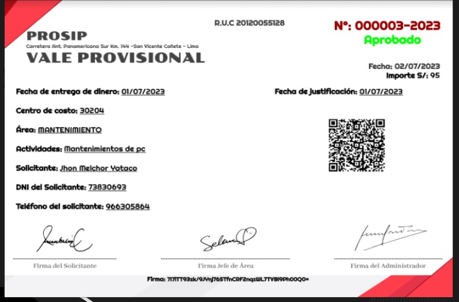
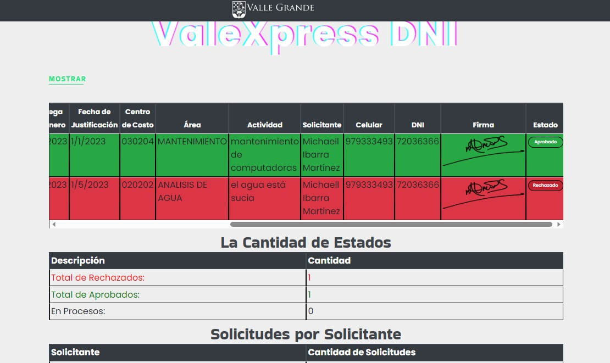
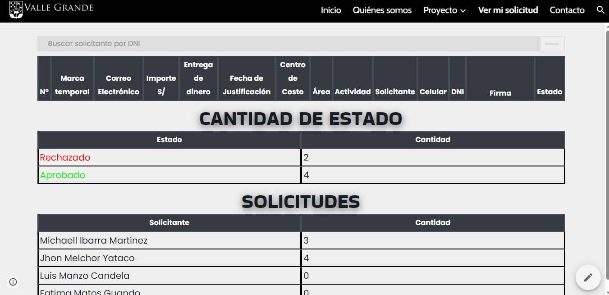

 

  

  <h3 align="center">Sistema Automatización</h3>

  

    sistema echo para aprobar o rechazar un solicitante
     
     
    <a href="https://github.com/MichaellIbarra/MichaellIbarra"><strong>Explore the docs »</strong></a>
     
     
    <a href="https://github.com/MichaellIbarra/MichaellIbarra">View Demo</a>
    .
    <a href="https://github.com/MichaellIbarra/Automatizacion-ValeProvisional/issues">Report Bug</a>
    .
    <a href="https://github.com/MichaellIbarra/Automatizacion-ValeProvisional/issues">Request Feature</a>
  

    

## About The Project

There are many great README templates available on GitHub, however, I didn't find one that really suit my needs so I created this enhanced one. I want to create a README template so amazing that it'll be the last one you ever need.

Here's why:

* Your time should be focused on creating something amazing. A project that solves a problem and helps others
* You shouldn't be doing the same tasks over and over like creating a README from scratch
* You should element DRY principles to the rest of your life :smile:

## About The Project

## Roadmap

See the [open issues](https://github.com/MichaellIbarra/Automatizacion-ValeProvisional/issues) for a list of proposed features (and known issues).

## Contributing

Contributions are what make the open source community such an amazing place to be learn, inspire, and create. Any contributions you make are **greatly appreciated**.
* If you have suggestions for adding or removing projects, feel free to [open an issue](https://github.com/MichaellIbarra/Automatizacion-ValeProvisional/issues/new) to discuss it, or directly create a pull request after you edit the *README.md* file with necessary changes.
* Please make sure you check your spelling and grammar.
* Create individual PR for each suggestion.
* Please also read through the [Code Of Conduct](https://github.com/MichaellIbarra/Automatizacion-ValeProvisional/blob/main/CODE_OF_CONDUCT.md) before posting your first idea as well.

### Creating A Pull Request

1. Fork the Project
2. Create your Feature Branch (`git checkout -b feature/AmazingFeature`)
3. Commit your Changes (`git commit -m 'Add some AmazingFeature'`)
4. Push to the Branch (`git push origin feature/AmazingFeature`)
5. Open a Pull Request

## License

Distributed under the MIT License. See [LICENSE](https://github.com/MichaellIbarra/Automatizacion-ValeProvisional/blob/main/LICENSE.md) for more information.

## Authors

* **Matichelo** - *Developer Backend* - [Matichelo](https://github.com/Matichelo) - **

## Acknowledgements

* 
* 
* 
